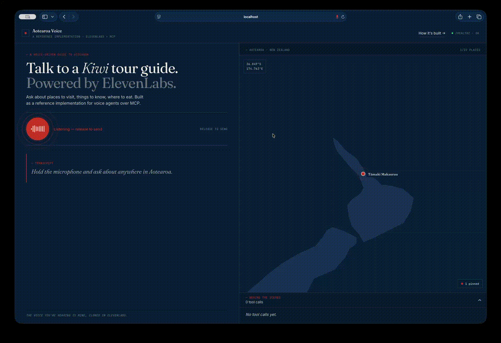

# Aotearoa Voice

> A voice-driven tour guide to Aotearoa New Zealand — an end-to-end reference implementation of voice agent + MCP tool calling, with my own cloned voice as the guide.



**The voice you're hearing is mine, cloned in ElevenLabs.** I'm an existing ElevenLabs subscriber — I've used voice cloning in production at [Summit53](https://summit53.io), the CRM I run as a solo developer-founder. This artefact extends that real customer use case into a public reference implementation for voice agents over MCP.

Hold the microphone, ask a Kiwi tour guide about Aotearoa, hear the answer back. Built end-to-end — voice frontend, Claude agent layer, MCP server with curated tour tools, deployed via Docker and Cloudflare Tunnel.

Built across two evenings as the artefact for my application for the **ElevenLabs Solutions Engineer (Oceania)** role.

---

## Try it

**Live demo:** https://aotearoa.jsull.net

**Run it locally:**

```bash
git clone https://github.com/<your-handle>/aotearoa-voice
cd aotearoa-voice
cp .env.example .env
# Fill in API keys: ANTHROPIC, OPENAI (Whisper), ELEVENLABS + your cloned voice ID
docker compose up --build
```

Then open the frontend at http://localhost:5173. The backend is on http://localhost:8002 and the MCP server on http://localhost:8001/sse.

Press and hold the microphone (or hold the spacebar) to talk. The transcript appears on the left as you speak, the map pans to whichever location the agent surfaces, and the *Behind the scenes* panel shows the live MCP tool calls that built the answer.

---

## What it demonstrates

1. **Voice authenticity.** ElevenLabs Multilingual v2 with a cloned Kiwi voice and a Te Reo Māori pronunciation dictionary handling place names — Aotearoa, Tāmaki Makaurau, Wai-O-Tapu, Piopiotahi, Whakatāne — with phoneme-level correctness, not the model's best guess.
2. **End-to-end agent architecture.** Push-to-talk frontend → Whisper transcription → Claude with MCP tool calling → ElevenLabs streaming TTS. A real runnable system you can clone — not a notebook, not slideware. Targets sub-4s end-to-end.
3. **MCP as a first-class integration surface.** The 22 curated locations and pronunciation rules live behind a standalone SSE-based MCP server. The same server powers both the voice frontend *and* a Claude Desktop integration if you point it at the SSE endpoint.

---

## Architecture

```
┌────────────────────────────────────────────────────────────────┐
│  Browser (React + TypeScript)                                  │
│  • Push-to-talk UI                                             │
│  • Hand-drawn NZ canvas with pin animation                     │
│  • Audio capture (MediaRecorder) & playback                    │
└────────────────────────────────────────────────────────────────┘
                          │
                          │ HTTPS via Cloudflare Tunnel
                          ▼
┌────────────────────────────────────────────────────────────────┐
│  Local Docker (or Cloud Run — see deploy/cloud-run/)           │
│                                                                │
│  ┌───────────────────────┐   ┌───────────────────────┐         │
│  │ FastAPI backend       │   │ MCP server (SSE)      │         │
│  │ /api/transcribe       │◄─►│ 5 tour tools          │         │
│  │ /api/chat             │   │ 22 locations + IPA    │         │
│  │ /api/synthesise       │   └───────────────────────┘         │
│  └───────────────────────┘                                     │
└────────────────────────────────────────────────────────────────┘
                          │
            ┌─────────────┼─────────────┐
            ▼             ▼             ▼
    ┌─────────────┐ ┌─────────────┐ ┌─────────────┐
    │ Whisper API │ │ Anthropic   │ │ ElevenLabs  │
    │ (STT)       │ │ Claude API  │ │ TTS API     │
    │             │ │ + MCP loop  │ │ Cloned voice│
    │             │ │             │ │ + dictionary│
    └─────────────┘ └─────────────┘ └─────────────┘
```

See [ARCHITECTURE.md](ARCHITECTURE.md) for the deeper walkthrough — the conversational loop, latency budget, the agent loop's prompt-caching strategy, and the frontend API contract.

---

## MCP tool surface

Five tools exposed by the MCP server. Clean, purposeful, no kitchen-sink.

| Tool | Inputs | Purpose |
| --- | --- | --- |
| `find_locations` | `region?`, `theme?` | List curated locations, optionally filtered |
| `get_location_detail` | `location_id` | Full record: description, things to do, transit, nearby food/walks |
| `get_weather` | `location_id` | Realistic seasonal stub — long-run averages, not a live forecast |
| `get_pronunciation_guide` | `word` | Verified Te Reo pronunciation; never guesses |
| `find_nearby` | `location_id`, `category` | Food / accommodation / walks near a location |

The server speaks plain MCP over SSE at `/sse`. Point Claude Desktop at it (or any other MCP client) to call the same tools without going through the voice frontend at all — the demo is the most polished consumer of this MCP server, not the only one.

---

## Design decisions

**Why my own cloned voice instead of an ElevenLabs preset.** Authenticity by definition — real Kiwi accent, no synthetic-sounding artefacts on Te Reo place names I'd actually say myself. It also frames the cloning capability as a real customer adoption story, since I'm an existing ElevenLabs subscriber using cloning in production at Summit53. Memorable without being cringeworthy: the SE candidate is literally the voice of the demo.

**Why a pronunciation dictionary alongside the cloned voice.** Voice cloning gives accent fidelity, but it doesn't tell the model how to pronounce words it's never heard the source say. Te Reo Māori place names — Aotearoa, Tāmaki Makaurau, Whangārei, Whakatāne, Tāhuna — are exactly that failure mode. The PLS dictionary at [scripts/pronunciations.pls](scripts/pronunciations.pls) supplies IPA transcriptions for ~25 place names, iwi, and greetings; ElevenLabs substitutes them in at synthesis time. Set up via [scripts/setup_pronunciation_dict.py](scripts/setup_pronunciation_dict.py) — uploads once, then every TTS call references it.

**Why MCP over a custom REST API.** The agent and the tools want to be loosely coupled — the same tool surface should serve voice, Claude Desktop, and any future CLI without per-client glue. MCP is the right protocol for that. It also signals which protocol the agent ecosystem is converging on.

**Why Claude as the agent layer.** Native MCP tool calling, strong instruction-following on response brevity (which makes or breaks voice UX), and prompt caching that cuts ~80% of input tokens on repeat turns within a 5-minute window. See [backend/app/agent/claude_client.py](backend/app/agent/claude_client.py) for the loop.

**Why Whisper for STT.** Sub-second latency on short clips, cheap, and handles English-with-embedded-Te-Reo-proper-nouns well — exactly the input shape this demo produces. We pass a soft vocabulary hint to bias it towards the place names we know about.

**Why local Docker + Cloudflare Tunnel over serverless for the demo.** Zero hosting cost for a demo with unpredictable lifecycle. Faster iteration loop. Mirrors the production architecture I run at Summit53 (self-hosted, cloud as fallback). A Cloud Run alternative is documented in [deploy/cloud-run/](deploy/cloud-run/) for reviewers who want to spin it up on their own infrastructure — same images, three managed services, one script.

**Why response length is in the system prompt.** Long agent responses kill voice UX — three sentences feels conversational, twelve feels like a podcast. The system prompt enforces a hard 2-3 sentence cap unless the user explicitly asks for more.

---

## Production considerations

What's *not* production-grade in this demo, and what would change for a real customer deployment:

| Concern | Demo posture | Production posture |
| --- | --- | --- |
| Authentication | None — public demo URL | OAuth or API key per tenant |
| Rate limiting | Per-IP token bucket (in-memory) | Redis-backed limiter, per-tenant quotas |
| Conversation memory | Stateless; client passes history | Server-side store with TTL + tenant scoping |
| Observability | Structured logs only | Tracing (OTel), metrics, evals on agent outputs |
| Agent evaluation | Manual | Golden-set evals on tool selection + response brevity |
| TTS caching | None | Cache common phrases; reuse audio across users |
| Multi-tenancy | None | Voice ID, system prompt, and tools per tenant |
| Cost controls | Generous demo budget + per-key credit caps | Per-tenant token / TTS-character budgets with fallbacks |
| Failure handling | Inline error turns in the transcript | Structured error telemetry + automated rollback |

Naming what's missing reads as senior engineering; pretending nothing is reads as junior.

---

## Same architecture, applied commercially

The pattern this demo implements — push-to-talk frontend, STT, Claude with MCP tool calling, ElevenLabs streaming TTS, and an MCP server that exposes domain tools — generalises directly to:

- **SDR / outbound voice agents** that can search a CRM, look up account history, and book meetings without leaving the call.
- **Customer support deflection** where the MCP tools wrap the knowledge base and ticketing system, and the agent escalates only when it can't resolve.
- **Internal employee assistants** (HR, IT, finance) where the same agent loop wraps internal APIs as MCP tools.
- **Contact-centre augmentation** where ElevenLabs supplies the voice persona and MCP supplies the integrations.

The voice quality is what makes any of these acceptable to a real human on the other end of the line. That's the bet ElevenLabs is making, and it's the right one.

---

## About

I'm Jamie Sullivan — Auckland-based developer-founder of [Summit53](https://summit53.io), a CRM and revenue-intelligence product I've built solo. I've shipped ElevenLabs voice cloning into production at Summit53 for product walkthroughs and outbound prospecting; you're hearing the same cloned voice here.

I built this artefact across two evenings as part of my application for the **Oceania Solutions Engineer role at ElevenLabs** — I'd rather show than tell, and the SE muscle the role calls for is exactly what reference implementations like this one demand. The Auckland time zone is a feature for any Oceania-facing customer; the demo makes it implicit.

---

## Acknowledgements & licence

**Te Reo Māori is taonga.** This demo treats Te Reo place names as common names where they genuinely are (Aotearoa, Tāmaki Makaurau, Aoraki, Piopiotahi, Whakatū) and supplies verified IPA pronunciations in the dictionary. It does not perform cultural authority — locations are well-known public attractions, descriptions stay at tourist-information depth, and the agent is instructed to redirect questions about iwi, marae, and tikanga to local sources.

Pronunciations were verified against published references; if anything sounds wrong, the IPA is in [scripts/pronunciations.pls](scripts/pronunciations.pls) — pull requests welcome.

Released under the [MIT licence](LICENSE).
